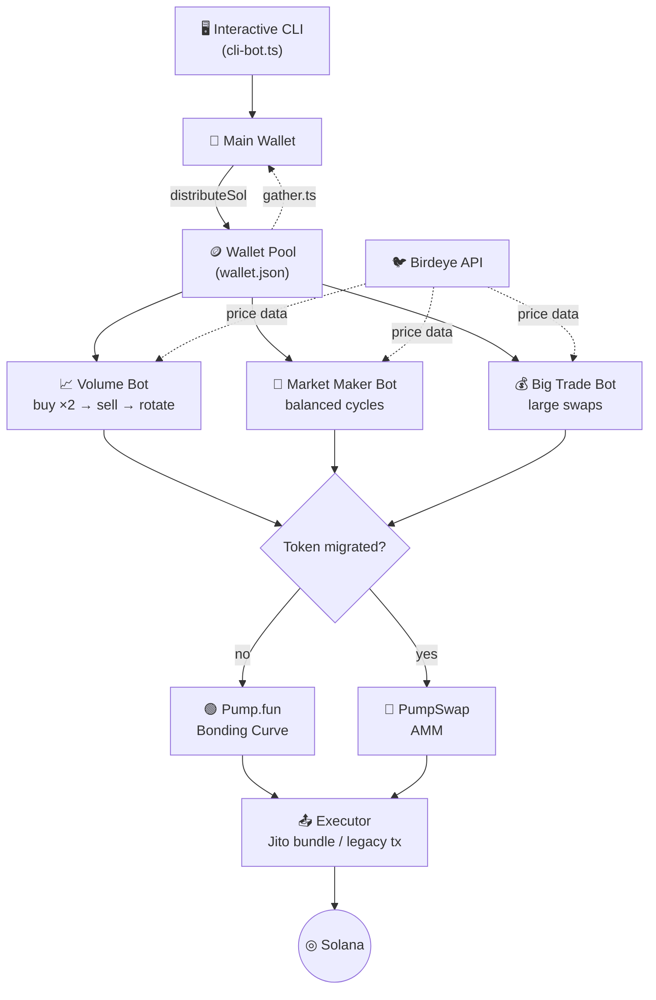
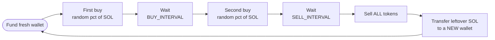

<div align="center">

# 🚀 Pump.fun Volume Bot

**An automated multi-wallet volume & market-making bot for [Pump.fun](https://pump.fun) and PumpSwap tokens on Solana.**

Distribute SOL across a rotating fleet of fresh wallets and generate organic-looking volume, new makers, and steady buy pressure — fully automated from an interactive CLI.

<p>
  
  
  
  
</p>

<p>
  <a href="https://t.me/Kei4650">
    
  </a>
</p>

📩 **Need help or a custom build? Contact me on Telegram → [@Kei4650](https://t.me/Kei4650)**

</div>

---

## 📖 Overview

This bot automates the distribution of SOL to many freshly-generated wallets and runs **endless buy / sell swaps** against a target token simultaneously. It trades directly through the **Pump.fun bonding curve** and routes to **PumpSwap** once a token has migrated — no third-party aggregator required.

Unlike fixed-wallet volume bots, every trading round rotates SOL into a **brand-new wallet**, so each round adds a unique maker to the chart instead of reusing the same handful of addresses.

## ✨ Features

| | Feature | Description |
|---|---|---|
| ⚙️ | **Automated SOL distribution** | Splits SOL from your main wallet across a configurable fleet of generated wallets. |
| 🔄 | **Endless buy & sell swaps** | Runs continuous, randomized buy/sell cycles to produce steady volume. |
| 👥 | **Maker growth** | A new wallet is created every round, increasing the unique maker count — not just volume. |
| 📈 | **More buys than sells** | Each wallet buys twice and sells once, leaving net buy pressure. |
| 🧹 | **Sell-before-gather** | When collecting funds, leftover tokens are sold first so only SOL is gathered (token-account rent reclaimed). |
| ⚡ | **Jito bundle support** | Optional Jito MEV bundles for faster, more reliable landing (`JITO_MODE`). |
| 🖥️ | **Interactive CLI** | Menu-driven interface for wallet management, market making, and selling. |

## 🔁 Why V2? (Improvements over fixed-wallet bots)

| Old behavior ❌ | New behavior ✅ |
|---|---|
| Repetitive buy/sell from the **same** wallets (obvious on DexScreener) | Each round rotates SOL into a **fresh** wallet |
| Volume increased, but **maker count stayed flat** | **New makers** created every round |
| Gathered leftover **tokens** to the main wallet | **Sells tokens first**, gathers only SOL + reclaims rent |
| Equal buys and sells → **net sell pressure** | **2× buys per sell** → **net buy pressure** |

## 🏗️ Architecture



## ⚙️ How the Volume Strategy Works

Each volume wallet follows a rotating lifecycle that adds one new maker per round while keeping net buy pressure:



> **Result:** 2 buys for every 1 sell, and a unique maker address every cycle.

## 🤖 Bot Modes

When you split a fleet into the three engines, wallets are allocated as:

| Mode | Wallet share | Behavior |
|---|---|---|
| 📈 **Volume Bot** | 20% | Continuous randomized buy/sell to build steady volume. |
| 🤖 **Market Maker Bot** | 30% | Balanced buy/sell cycles that maintain two-sided activity. |
| 💰 **Big Trade Bot** | 50% | Larger swaps that create more noticeable price movement. |

All three run **in parallel** for the configured runtime.

## 🧰 Tech Stack

- **Runtime:** Node.js + TypeScript (`ts-node`)
- **Chain:** Solana — `@solana/web3.js`, `@solana/spl-token`
- **Programs:** Pump.fun + PumpSwap (Anchor IDLs via `@coral-xyz/anchor`)
- **Execution:** Jito bundles (`jito-ts`) or legacy transactions
- **Data:** Birdeye API for price, Helius/any RPC for the chain
- **CLI:** `inquirer` interactive prompts

## 📋 Requirements

- **Node.js ≥ 18**
- A funded **Solana main wallet** (base58 private key)
- A reliable **RPC endpoint** (e.g. [Helius](https://helius.dev), QuickNode)
- *(Optional)* A **Birdeye API key** for price data

## 📦 Installation

```bash
# 1. Clone the repository
git clone https://github.com/keidev-sol/Pumpfun-Volume-Bot.git
cd Pumpfun-Volume-Bot

# 2. Install dependencies
npm install

# 3. Create your environment file
cp .env.example .env
#    then edit .env with your keys and settings
```

## 🔧 Configuration

Set the following variables in your `.env` file:

```env
# ── Connection ──────────────────────────────
PRIVATE_KEY=                 # Base58 secret key of your main wallet
RPC_ENDPOINT=                # Solana RPC URL
RPC_WEBSOCKET_ENDPOINT=      # Solana WebSocket RPC URL

# ── Distribution ────────────────────────────
DISTRIBUTE_WALLET_NUM=5      # Wallets running in parallel (recommended ≤ 20)
SOL_AMOUNT_TO_DISTRIBUTE=0.05 # SOL sent to each generated wallet
DISTRIBUTE_INTERVAL_MIN=300  # Min delay between distributions (ms)
DISTRIBUTE_INTERVAL_MAX=500  # Max delay between distributions (ms)

# ── Buy settings ────────────────────────────
BUY_UPPER_PERCENT=50         # Max % of a wallet's SOL used per buy
BUY_LOWER_PERCENT=30         # Min % of a wallet's SOL used per buy
BUY_INTERVAL_MIN=100         # Min seconds between buys
BUY_INTERVAL_MAX=200         # Max seconds between buys

# ── Sell settings ───────────────────────────
SELL_INTERVAL_MIN=100        # Min seconds before selling
SELL_INTERVAL_MAX=150        # Max seconds before selling

# ── Trade / fees ────────────────────────────
SLIPPAGE=50                  # Slippage in percent
FEE_LEVEL=10                 # Priority-fee level (10 = standard)
JITO_MODE=false              # Use Jito bundles (true/false)
JITO_FEE=0.0001              # Jito tip in SOL when JITO_MODE=true

# ── Token & addresses ───────────────────────
TOKEN_MINT=                  # Mint address of the token to trade
BIRDEYE_KEY=                 # Birdeye API key (price data)
GATHER_ADDRESS=              # Destination wallet for gathered SOL
AIRDROP_ADDRESS=             # (Optional) airdrop destination
```

> ⚠️ Keep at least ~`0.005 SOL` in the main wallet as a fee buffer (`FEE_BUFFER`). Token mints ending in `pump` trade on the bonding curve until they migrate to PumpSwap.

## 🚀 Usage

Start the interactive CLI:

```bash
npm start      # or: npm run bot   /   npx ts-node cli-bot.ts
```

You'll be presented with the main menu:

```
🚀 Pump.fun Volume Bot
────────────────────────────
  💼 Wallet Manager
  🤖 Market Maker Mode
  💰 Sell Mode
  ❌ Exit
```

### 💼 Wallet Manager
- **🔄 Generate Wallets + Distribute SOL** — create wallets and fund them
- **👀 View Wallets** — check SOL & token balances across the fleet
- **💰 Sell Tokens** — rotate through wallets selling a chosen %
- **💸 Collect SOL** — gather all SOL back to your main wallet
- **🔄 Transfer All Tokens to 1 Wallet & Sell** — consolidate, sell, then collect

### 🤖 Market Maker Mode
Launch the market-maker engine for a custom runtime and monitor its progress.

### 💰 Sell Mode
Continuously rotates through `wallet.json`, selling a set percentage from each wallet on a fixed time interval (e.g. *sell 1% every 1 minute*) until stopped.

### 💸 Gather funds back

```bash
npm run gather                 # sell leftover tokens, then collect SOL
npm run gather_without_sell    # collect SOL only (leave tokens untouched)
```

## 📁 Project Structure

```
Pumpfun-Volume-Bot/
├── cli-bot.ts          # Interactive CLI entry point (menus, wallet manager)
├── index.ts            # Core bot logic: distribute, buy, sell, run* engines
├── gather.ts           # Sell-then-collect SOL from all wallets
├── gather_without_sell.ts
├── constants/          # RPC, program IDs, env-driven config
├── contract/           # Pump.fun + PumpSwap IDLs and typed clients
├── executor/           # Jito bundle & legacy transaction senders
├── utils/              # Bonding curve, swap helpers, file/wallet utils
└── wallet.json         # Generated wallet data (DO NOT share / commit)
```

## 🔒 Security Notes

- **Never commit real keys.** `wallet.json` and `.env` hold private keys — keep them out of version control and rotate any key that leaks.
- Use a **dedicated funding wallet**, not your main holdings.
- Test with **small amounts** first and confirm RPC stability before scaling up.

## ⚠️ Disclaimer

This software is provided for **educational purposes only**. Generating artificial trading volume may violate the terms of service of certain platforms and the laws or regulations of your jurisdiction. You are solely responsible for how you use this tool. The authors assume **no liability** for any losses, damages, or legal consequences.

## 👤 Author

**Kei Novak**

- Twitter / X: [@kei_4650](https://twitter.com/kei_4650)
- Telegram: [@Kei4650](https://t.me/Kei4650)

> Reach out for help, custom features, or other Solana trading projects.
